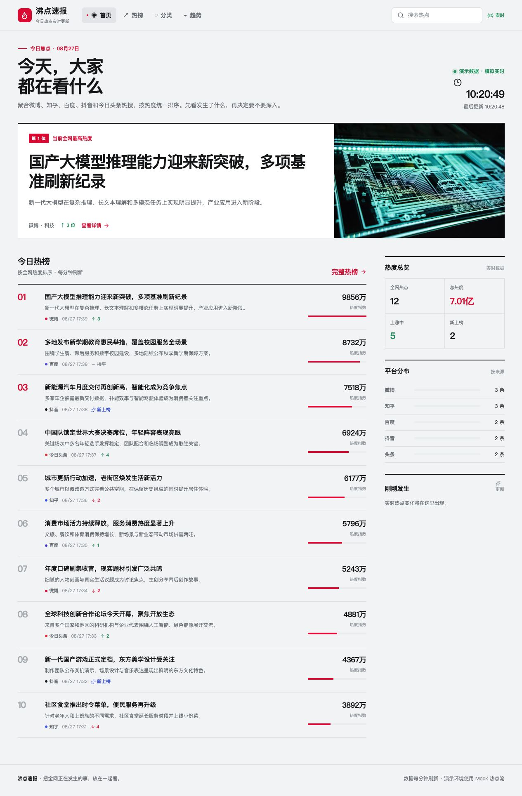

# 沸点速报

> 把全网正在发生的事，放在一起看。

[](https://openjdk.org/)
[](https://spring.io/projects/spring-boot)
[](https://vuejs.org/)
[](https://www.typescriptlang.org/)
[](#开发状态)

沸点速报是一个面向普通用户的实时热点聚合项目。它把知乎、百度、今日头条、哔哩哔哩、掘金、澎湃新闻、IT之家、36 氪、金十数据、Hacker News 和华尔街见闻的公开内容统一成一套可比较的榜单数据，让用户打开页面就能知道“现在大家都在讨论什么”。微博和抖音保留为平台模型，待有稳定且合规的公开入口后接入。

当前版本已经接入十一个公开数据来源，并具备完整的前后端分层、数据库模型、榜单查询、趋势曲线、SSE 实时更新和响应式前端。开发与测试环境仍保留 Mock Collector，新增平台只需实现统一采集接口，不需要重写页面。



## 特性

- 综合热榜：按统一热度排序，展示排名、排名变化、来源和更新时间。
- 真实数据：低频采集十一个公开来源，映射标题、摘要、排名、热度（有来源数值时）、封面与原始链接。
- 多平台模型：微博、知乎、百度、抖音、今日头条使用统一字段和独立筛选入口。
- 跨平台分类榜：聚合全部来源，按综合、社会、科技、娱乐、体育、财经、国际、游戏、汽车、生活独立排行。
- 热点详情：原始来源、当前热度、排名变化、24 小时趋势和相关热点。
- 实时更新：定时采集 + 历史快照 + SSE 事件流 + Pinia 状态联动。
- 可替换采集器：基于 `HotSearchCollector` 接口扩展新平台。
- 可排查日志：前后端记录请求、查询、采集、缓存、SSE 连接和异常上下文。
- 真实产品取向：资讯产品布局，不使用后台管理模板，不依赖复杂 UI 组件库。

## 技术栈

| 层级 | 技术 |
| --- | --- |
| Web | Vue 3、Vite、TypeScript、Vue Router、Pinia、Tailwind CSS |
| 可视化 | ECharts（按需注册） |
| 交互 | Axios、原生 EventSource、Lucide Icons |
| Server | Java 17、Spring Boot 3.5、Spring MVC、MyBatis-Plus |
| Storage | MySQL 8、Redis |
| Test | JUnit 5、Spring Boot Test、MockMvc、H2 |

## 项目结构

```text
.
├── boiling-point-news-server/       # Spring Boot API、采集与实时推送
│   ├── src/main/java/com/boilingpoint/news/
│   │   ├── common/                  # Result、枚举和通用约定
│   │   ├── config/                  # MyBatis 等配置
│   │   ├── controller/              # REST / SSE 接口（持续建设中）
│   │   ├── converter/               # Entity / DTO / VO 转换
│   │   ├── dto/                     # 请求参数
│   │   ├── entity/                  # 数据库实体
│   │   ├── exception/               # 业务异常和全局处理
│   │   ├── mapper/                  # MyBatis-Plus Mapper
│   │   ├── service/                 # 查询服务
│   │   └── collector/               # 多平台采集器、分类器与 Mock 采集器
│   └── src/main/resources/
│       ├── db/                      # schema.sql、data.sql
│       └── mapper/                  # MyBatis XML
├── boiling-point-news-web/          # Vue 3 前端
│   └── src/
│       ├── api/                     # Axios、API 和 Mock 数据
│       ├── components/              # 榜单、Tab、趋势图等
│       ├── layouts/                 # 全站布局
│       ├── router/                  # 页面路由
│       ├── stores/                  # Pinia 热点状态
│       ├── utils/                   # 格式化、日志
│       └── views/                   # 首页、热榜、分类、趋势、详情
└── docs/preview.jpg                 # GitHub 项目预览图
```

## 快速开始

### 1. 前端

```bash
cd boiling-point-news-web
npm install
npm run dev
```

打开 <http://127.0.0.1:5173/>。

默认使用 Mock 数据，不依赖 MySQL、Redis 或后端即可浏览完整页面。需要查看真实百度热榜时，请按“无 Docker 本地联调”启动 Live 模式。

常用命令：

```bash
npm run build       # 类型检查 + 生产构建
npm run type-check  # 仅 TypeScript 检查
npm run preview     # 预览生产构建
```

### 2. 后端

环境要求：Java 17、Maven 3.9+、MySQL 8、Redis 6+。

先创建数据库并执行：

```bash
mysql -uroot -p boiling_point_news < boiling-point-news-server/src/main/resources/db/schema.sql
mysql -uroot -p boiling_point_news < boiling-point-news-server/src/main/resources/db/data.sql
```

再启动服务：

```bash
cd boiling-point-news-server
mvn spring-boot:run
```

默认服务地址为 <http://127.0.0.1:8080/>。数据库和 Redis 连接信息通过环境变量配置：

```bash
export DB_URL='jdbc:mysql://localhost:3306/boiling_point_news?useUnicode=true&characterEncoding=utf8&serverTimezone=Asia/Shanghai&useSSL=false'
export DB_USERNAME='root'
export DB_PASSWORD='your-password'
export REDIS_HOST='localhost'
export REDIS_PORT='6379'
```

### 3. 切换前端到后端 API

复制前端环境模板：

```bash
cd boiling-point-news-web
cp .env.example .env.local
```

修改为：

```text
VITE_DATA_MODE=live
VITE_API_BASE_URL=/api
VITE_SSE_URL=/api/sse/hot
```

### 4. 无 Docker 本地联调

不希望连接本机 MySQL 时，可以使用隔离的 `local` 配置。该配置使用内存 H2 演示库和 Redis 1 号库，不会修改 MySQL 数据：

```bash
cd boiling-point-news-server
SPRING_PROFILES_ACTIVE=local SERVER_PORT=18080 mvn spring-boot:run
```

另开终端启动 Live 前端：

```bash
cd boiling-point-news-web
VITE_DATA_MODE=live \
VITE_DEV_PORT=15173 \
VITE_DEV_PROXY_TARGET=http://127.0.0.1:18080 \
npm run dev
```

访问 <http://127.0.0.1:15173/>。`local` Profile 使用 H2 内存库并启用真实公开来源采集器，不写入本机 MySQL。后端日志包含请求 ID、采集批次、SQL、缓存降级和 SSE 连接信息，前端日志统一使用 `[沸点速报]` 前缀。

## 真实数据源

当前已接入十一个无需授权的公开数据源：百度热榜、知乎 `hot-list-web`、今日头条热榜、哔哩哔哩热门视频、掘金文章热榜、澎湃新闻热榜、IT之家列表页、36 氪快讯页、金十数据公开快讯脚本、Hacker News Firebase Top Stories，以及华尔街见闻公开快讯流。Hacker News 通过官方公开接口按榜单 ID 拉取条目详情，金十与华尔街见闻解析公开快讯数据；这些采集器均保存平台原始详情地址，直接跳转到对应文章、视频或快讯页面。

微博暂不接入：公开页面会跳转微博访客身份页，NewsNow 使用了硬编码访客 Cookie，不能作为本项目的稳定数据源。抖音暂不接入：公开热榜依赖动态签名和风控校验，直接抓取会返回空响应或验证页。本项目不会绕过这些限制；后续如有官方授权或无需身份验证的稳定公开入口，再增加对应采集器。

```bash
export BAIDU_COLLECTOR_ENABLED=true
export BAIDU_COLLECTOR_URL='https://top.baidu.com/board?tab=realtime'
export BAIDU_COLLECTOR_LIMIT=30
export BAIDU_COLLECTOR_TIMEOUT=10s
export TOUTIAO_COLLECTOR_ENABLED=true
export TOUTIAO_COLLECTOR_URL='https://www.toutiao.com/hot-event/hot-board/?origin=toutiao_pc'
export TOUTIAO_COLLECTOR_LIMIT=30
export TOUTIAO_COLLECTOR_TIMEOUT=10s
export ZHIHU_COLLECTOR_ENABLED=true
export ZHIHU_COLLECTOR_URL='https://www.zhihu.com/api/v3/feed/topstory/hot-list-web?limit=20&desktop=true'
export ZHIHU_COLLECTOR_LIMIT=20
export ZHIHU_COLLECTOR_TIMEOUT=10s
export BILIBILI_COLLECTOR_ENABLED=true
export BILIBILI_COLLECTOR_LIMIT=30
export JUEJIN_COLLECTOR_ENABLED=true
export JUEJIN_COLLECTOR_LIMIT=30
export THE_PAPER_COLLECTOR_ENABLED=true
export ITHOME_COLLECTOR_ENABLED=true
export KR36_COLLECTOR_ENABLED=true
export JIN10_COLLECTOR_ENABLED=true
export HACKER_NEWS_COLLECTOR_ENABLED=true
export WALLSTREET_CN_COLLECTOR_ENABLED=true
export COLLECTOR_INITIAL_DELAY=10000
export COLLECTOR_FIXED_DELAY=60000
```

| 变量 | 默认值 | 说明 |
| --- | --- | --- |
| `BAIDU_COLLECTOR_ENABLED` | `true` | 是否启用百度真实数据源 |
| `BAIDU_COLLECTOR_URL` | 百度实时榜公开页面 | 便于测试时替换为本地样例 |
| `BAIDU_COLLECTOR_LIMIT` | `30` | 单次最多保留的榜单条数，范围 1-50 |
| `BAIDU_COLLECTOR_TIMEOUT` | `10s` | 单次 HTTP 请求超时 |
| `TOUTIAO_COLLECTOR_ENABLED` | `true` | 是否启用今日头条真实数据源 |
| `TOUTIAO_COLLECTOR_URL` | 今日头条热榜公开接口 | 便于测试时替换为本地样例 |
| `TOUTIAO_COLLECTOR_LIMIT` | `30` | 单次最多保留的榜单条数，范围 1-50 |
| `TOUTIAO_COLLECTOR_TIMEOUT` | `10s` | 单次 HTTP 请求超时 |
| `ZHIHU_COLLECTOR_ENABLED` | `true` | 是否启用知乎真实数据源 |
| `ZHIHU_COLLECTOR_URL` | 知乎 `hot-list-web` 公开接口 | 便于测试时替换为本地样例 |
| `ZHIHU_COLLECTOR_LIMIT` | `20` | 单次最多保留的榜单条数，范围 1-50 |
| `ZHIHU_COLLECTOR_TIMEOUT` | `10s` | 单次 HTTP 请求超时 |
| `BILIBILI_COLLECTOR_ENABLED` | `true` | 是否启用哔哩哔哩真实数据源 |
| `BILIBILI_COLLECTOR_URL` | B 站热门视频接口 | 便于测试时替换为本地样例 |
| `BILIBILI_COLLECTOR_LIMIT` | `30` | 单次最多保留的榜单条数，范围 1-50 |
| `BILIBILI_COLLECTOR_TIMEOUT` | `10s` | 单次 HTTP 请求超时 |
| `JUEJIN_COLLECTOR_ENABLED` | `true` | 是否启用掘金真实数据源 |
| `JUEJIN_COLLECTOR_URL` | 掘金文章热榜接口 | 便于测试时替换为本地样例 |
| `JUEJIN_COLLECTOR_LIMIT` | `30` | 单次最多保留的榜单条数，范围 1-50 |
| `JUEJIN_COLLECTOR_TIMEOUT` | `10s` | 单次 HTTP 请求超时 |
| `THE_PAPER_COLLECTOR_ENABLED` | `true` | 是否启用澎湃新闻真实数据源 |
| `THE_PAPER_COLLECTOR_URL` | 澎湃新闻右侧热榜接口 | 便于测试时替换为本地样例 |
| `THE_PAPER_COLLECTOR_LIMIT` | `30` | 单次最多保留的榜单条数，范围 1-50 |
| `THE_PAPER_COLLECTOR_TIMEOUT` | `10s` | 单次 HTTP 请求超时 |
| `ITHOME_COLLECTOR_ENABLED` | `true` | 是否启用 IT之家真实数据源 |
| `ITHOME_COLLECTOR_URL` | IT之家列表页 | 便于测试时替换为本地样例 |
| `ITHOME_COLLECTOR_LIMIT` | `30` | 单次最多保留的榜单条数，范围 1-50 |
| `ITHOME_COLLECTOR_TIMEOUT` | `10s` | 单次 HTTP 请求超时 |
| `KR36_COLLECTOR_ENABLED` | `true` | 是否启用 36 氪真实数据源 |
| `KR36_COLLECTOR_URL` | 36 氪快讯页 | 便于测试时替换为本地样例 |
| `KR36_COLLECTOR_LIMIT` | `30` | 单次最多保留的榜单条数，范围 1-50 |
| `KR36_COLLECTOR_TIMEOUT` | `10s` | 单次 HTTP 请求超时 |
| `JIN10_COLLECTOR_ENABLED` | `true` | 是否启用金十数据真实数据源 |
| `JIN10_COLLECTOR_URL` | 金十 `flash_newest.js` | 便于测试时替换为本地样例 |
| `JIN10_COLLECTOR_LIMIT` | `30` | 单次最多保留的榜单条数，范围 1-50 |
| `JIN10_COLLECTOR_TIMEOUT` | `10s` | 单次 HTTP 请求超时 |
| `HACKER_NEWS_COLLECTOR_ENABLED` | `true` | 是否启用 Hacker News 真实数据源 |
| `HACKER_NEWS_COLLECTOR_URL` | Firebase Top Stories 接口 | 便于测试时替换为本地样例 |
| `HACKER_NEWS_ITEM_URL` | Firebase Item 接口前缀 | 便于测试时替换为本地样例 |
| `HACKER_NEWS_COLLECTOR_LIMIT` | `30` | 单次最多保留的榜单条数，范围 1-50 |
| `HACKER_NEWS_COLLECTOR_TIMEOUT` | `10s` | 单次 HTTP 请求超时 |
| `WALLSTREET_CN_COLLECTOR_ENABLED` | `true` | 是否启用华尔街见闻真实数据源 |
| `WALLSTREET_CN_COLLECTOR_URL` | 华尔街见闻公开快讯接口 | 便于测试时替换为本地样例 |
| `WALLSTREET_CN_COLLECTOR_LIMIT` | `30` | 单次最多保留的榜单条数，范围 1-50 |
| `WALLSTREET_CN_COLLECTOR_TIMEOUT` | `10s` | 单次 HTTP 请求超时 |
| `COLLECTOR_FIXED_DELAY` | `60000` | 两次采集完成时间之间的间隔，建议不要低于一分钟 |

采集成功后，同平台已离榜的旧数据会标记为下线；请求失败、页面结构变化或返回空榜时，本批次不会覆盖已有数据，异常原因和耗时会写入后端日志。公开页面结构可能调整，因此生产使用前应评估目标站点规则并持续监控采集失败率。

## 页面路由

| 路由 | 页面 |
| --- | --- |
| `/` | 首页与综合实时热榜 |
| `/boards` | 平台热榜 |
| `/category/:code` | 跨平台分类热榜 |
| `/trends` | 热度趋势 |
| `/hot/:id` | 热点详情 |

## 数据与接口约定

热点统一模型包含：`title`、`source`、`category`、`hotValue`、`rank`、`previousRank`、`rankChange`、`trend`、`publishedAt` 和 `updatedAt`。

后端 REST 响应统一使用：

```json
{
  "code": 200,
  "message": "success",
  "data": {}
}
```

核心接口规划：

```text
GET /api/hot/list
GET /api/hot/{id}
GET /api/hot/ranking
GET /api/hot/trending
GET /api/hot/latest
GET /api/hot/search?keyword=人工智能
GET /api/hot/{id}/trend?hours=24&limit=100
GET /api/platform/list
GET /api/platform/{code}/hot
GET /api/category/list
GET /api/category/{code}/hot
GET /api/sse/hot
```

## 日志与排查

项目从第一阶段就保留可观察性：

- 后端使用 SLF4J，记录查询条件、结果数量、耗时、采集平台、SSE 连接和异常堆栈。
- 热点列表、详情、最新榜和趋势查询使用 Redis Cache-Aside；缓存不可用时自动回源数据库，并记录缓存读写告警。
- 每次 HTTP 请求都会生成或透传 `X-Request-Id`，响应头和日志均带该 ID，便于前后端串联排查。
- 开发环境启用 MyBatis SQL 日志，便于检查 SQL、参数和结果。
- 百度采集日志记录响应字节数、解析条数、持久化条数、离榜条数和批次耗时；失败保留上一批有效数据。
- 前端统一输出 `[沸点速报]` 前缀日志，记录 API 请求失败、SSE 连接/重连、Live 刷新和 Mock 更新。
- 日志不包含密码、Token、完整连接串或其他敏感信息。

## 开发状态

已完成：

- 数据库表、索引和初始化字典。
- Spring Boot 基础工程、统一响应和全局异常处理。
- Entity、DTO、VO、Converter。
- MyBatis-Plus Mapper 与 H2 集成测试。
- 热点查询、搜索、排行、趋势和平台/分类 Service。
- REST Controller、接口参数校验与请求链路日志。
- Redis Cache-Aside 缓存服务。
- 百度公开热榜采集器、关键词分类、结构化页面解析和字段标准化。
- Mock Collector、Collector Registry、定时采集、热点 upsert、离榜下线、排名变化计算和历史快照写入。
- SSE 服务端连接管理、心跳和采集完成事件推送。
- Vue 首页、热榜、分类、趋势、详情、搜索，以及 Live/Mock 双数据模式。
- 无 Docker 本地 Live 联调（H2 + 可选 Redis + 可配置端口）。

进行中：

- 第二个公开真实数据源及跨平台去重。
- 采集健康状态、失败率与数据新鲜度监控。

## 路线图

1. 接入更多合规公开数据源，增加跨平台去重和来源健康检查。
2. 增加关键词订阅、收藏、摘要和舆情聚类。

## 贡献

欢迎提交 Issue 或 Pull Request。新增平台时请实现统一的 `HotSearchCollector` 接口，并补充：

- 采集失败和空数据测试。
- 标准化字段映射说明。
- 关键路径日志。
- 前端来源颜色和平台文案。

## License

本项目暂未选择开源许可证。若用于公开分发或商业使用，请先补充合适的 License。
